# Azure Cloud Fundamentals and Data Pipeline Implementation using Azure Data Factory

## Objective
Understand Azure cloud fundamentals and build an end-to-end data pipeline using Azure Storage Account and Azure Data Factory.

## Step 1 – Resource Group
Created an Azure Resource Group to organize all resources used in the assignment.

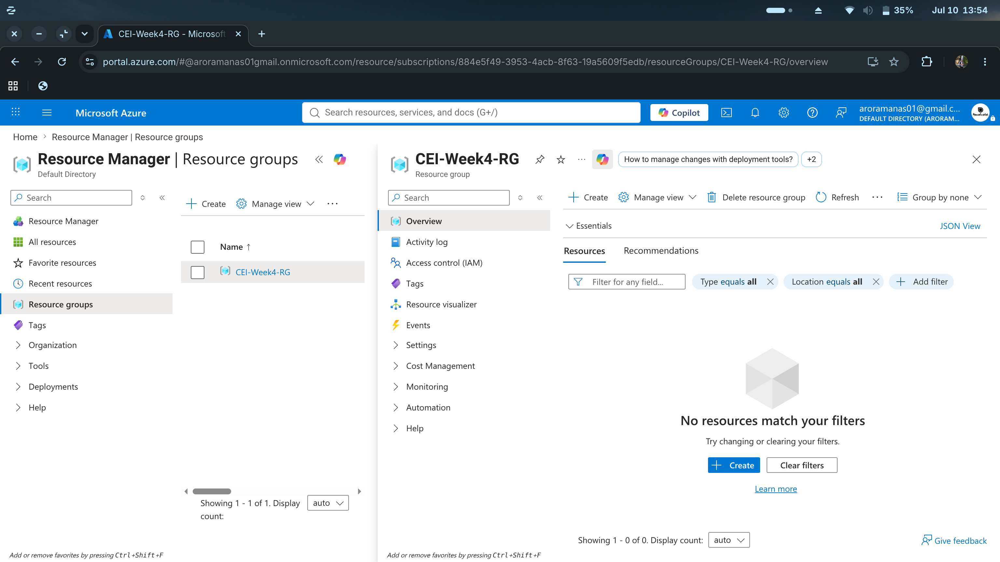

## Step 2 – Storage Account
Provisioned an Azure Storage Account to securely store the dataset and outputs.

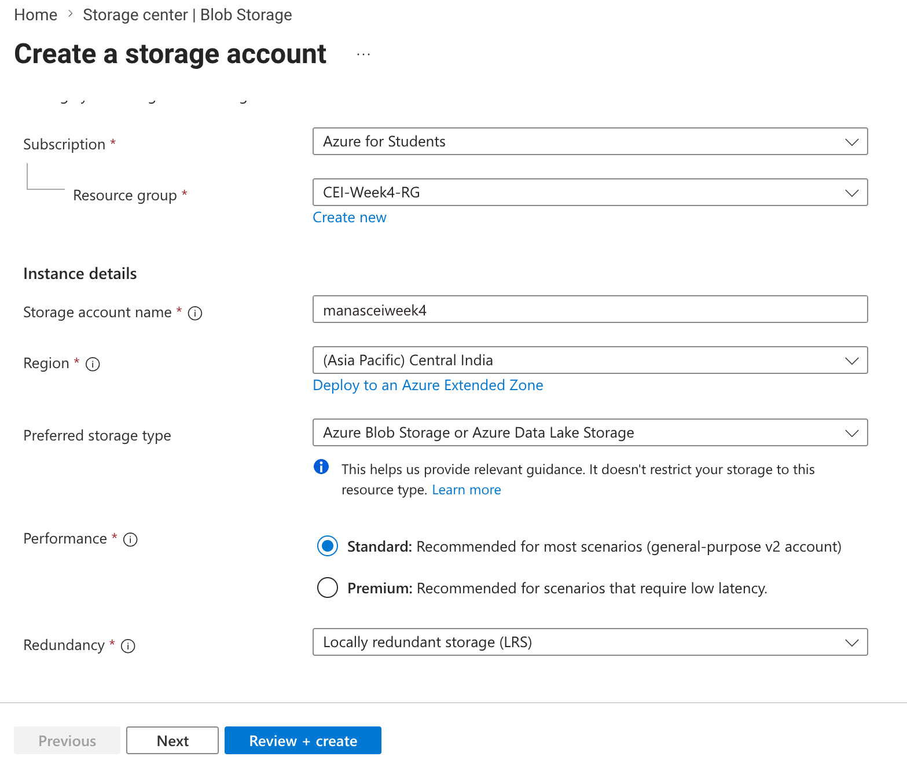

## Step 3 – Blob Containers
Set up Blob containers to act as source and destination repositories for the data pipeline.

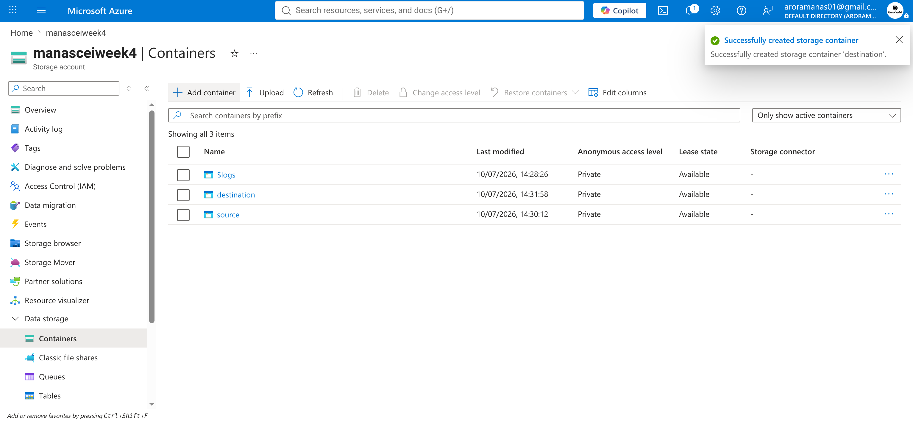

## Step 4 – CSV Uploaded
Uploaded the raw CSV dataset into the source Blob container.

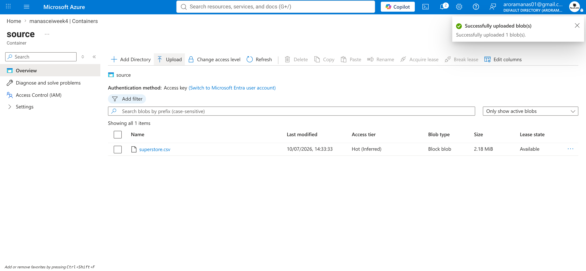

## Step 5 – ADF Overview
Provisioned an Azure Data Factory instance to orchestrate the data movement.

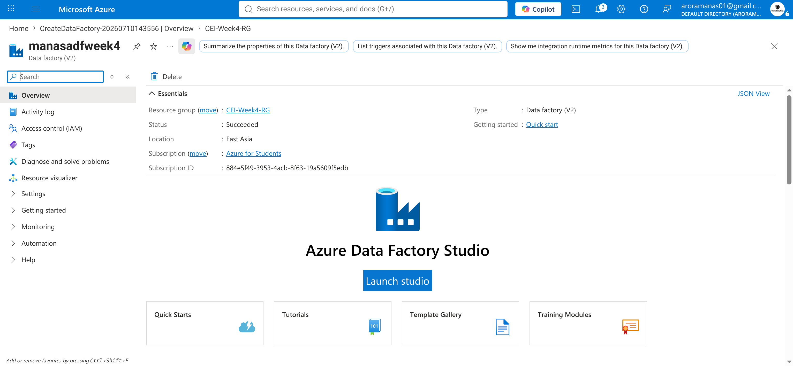

## Step 6 – ADF Studio Home
Launched the Azure Data Factory Studio to design and manage the data pipeline.

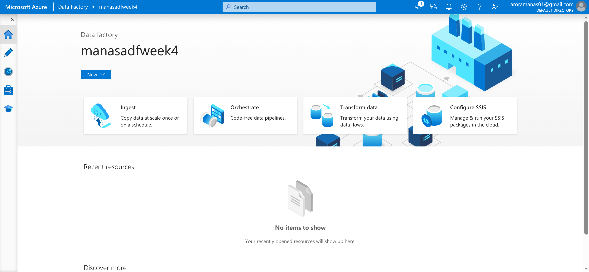

## Step 7 – Linked Service
Created a Linked Service to securely connect Azure Data Factory with the Storage Account.

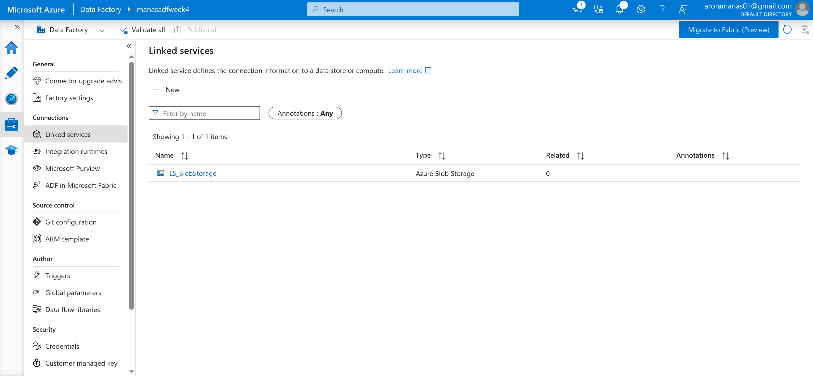

## Step 8 – Source Dataset
Configured a source dataset in ADF pointing to the uploaded CSV file in Blob storage.

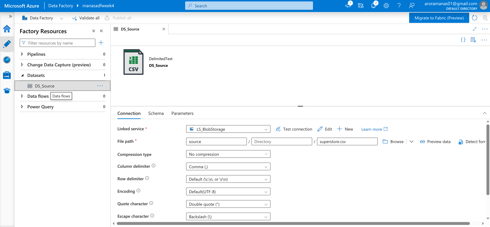

## Step 9 – Destination Dataset
Configured a destination dataset to define where the processed data will be saved.


## Step 10 – Pipeline Overview
Created a new data pipeline to connect the source and destination datasets.

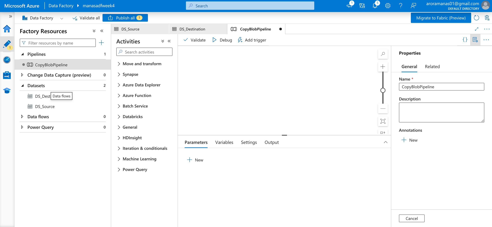

## Step 11 – Get Metadata
Implemented a Get Metadata activity to validate the structure and existence of the source file.

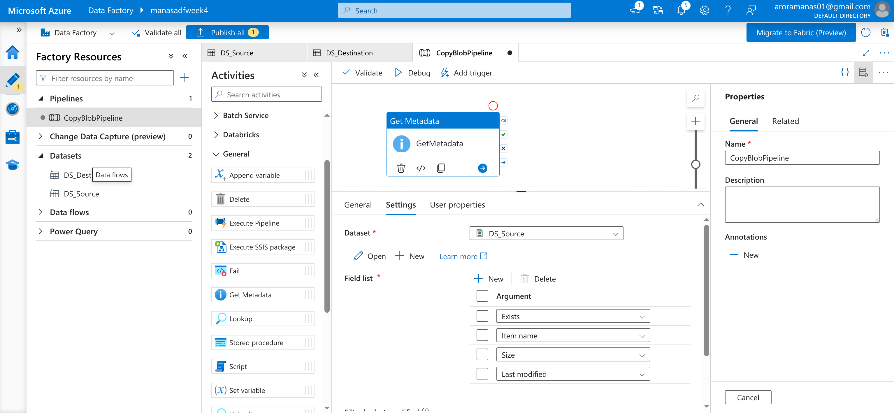

## Step 12 – Copy Data Pipeline
Added a Copy Data activity to securely transfer the data from the source to the destination container.

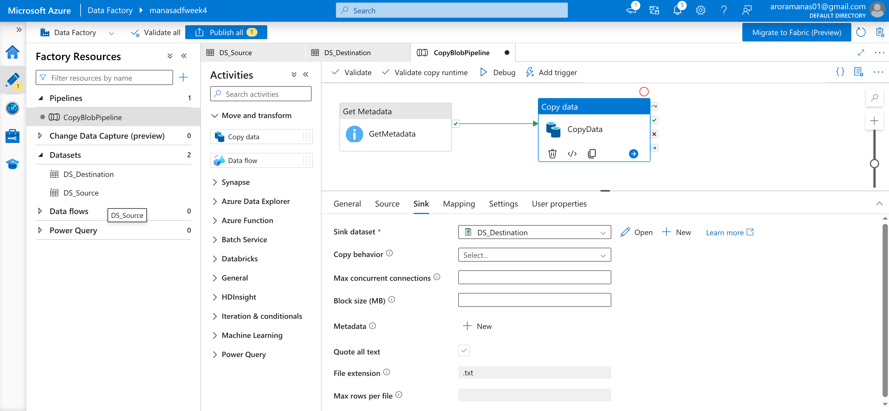

## Step 13 – Publish Success
Published all pipeline components to save and deploy the configurations in ADF.

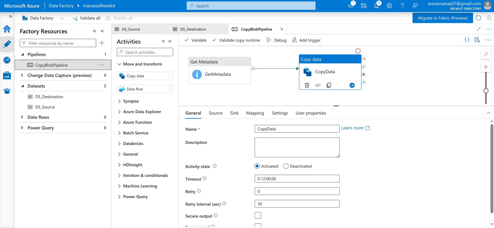

## Step 14 – Debug Success
Executed a debug run to validate the pipeline flow without errors.

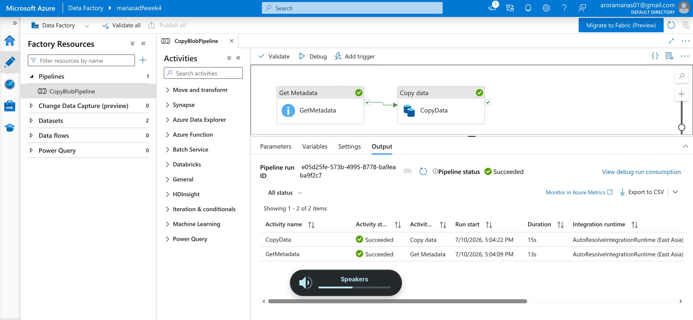

## Step 15 – Pipeline Run
Triggered a manual pipeline run to process the data in the production environment.

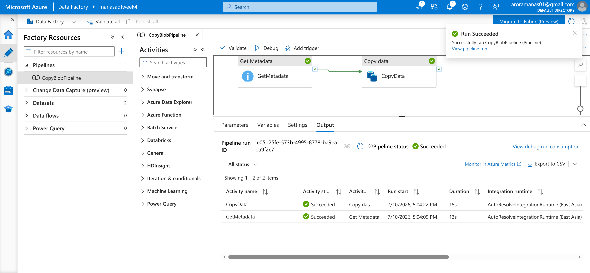

## Step 16 – IAM Roles
Configured Identity and Access Management (IAM) roles to ensure secure and least-privilege access.

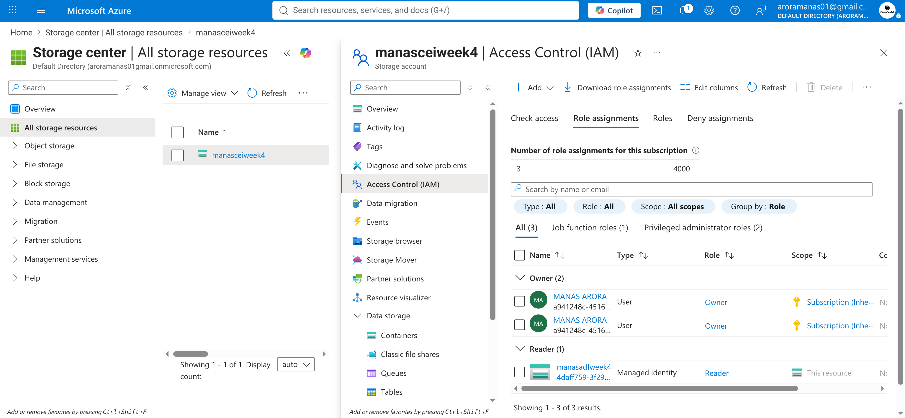

## Step 17 – Monitor
Monitored the pipeline execution using the ADF monitoring dashboard to track activity success.

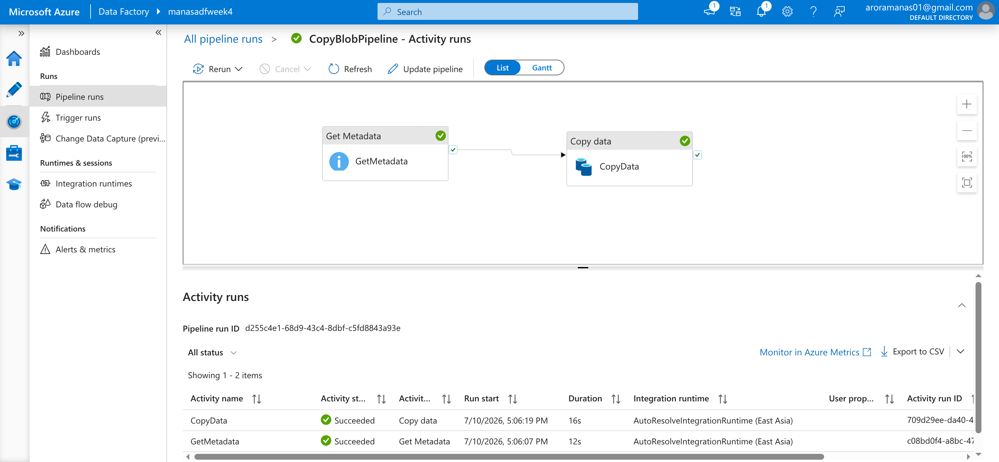

## Step 18 – Output File
Verified the successful transfer of the dataset in the destination Blob container.

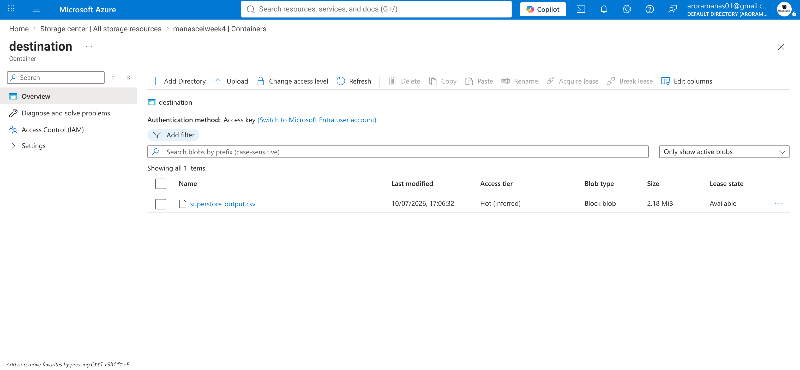

## Folder Structure

```text
Week-4/
│
├── README.md
├── Week4_Assignment.ipynb
├── Week4_Assignment.pdf
├── DataSet/
│   └── superstore.csv
├── Resource/
│   └── Week 4 Task.pdf
└── Screenshots/
    └── (18 Screenshots)
```

## File Description
- **[`Week4_Assignment.ipynb`](./Week4_Assignment.ipynb)**: The Jupyter Notebook version of this README, documenting all steps.
- **[`Week4_Assignment.pdf`](./Week4_Assignment.pdf)**: The exported PDF document containing the full assignment report with screenshots.
- **[`DataSet/superstore.csv`](./DataSet/superstore.csv)**: The raw dataset uploaded to Azure Blob Storage.
- **[`Resource/Week 4 Task.pdf`](./Resource/Week%204%20Task.pdf)**: The official assignment tasks and guidelines for Week 4.
- **`Screenshots/`**: Directory containing all step-by-step pipeline execution screenshots.

## Technologies Used
- Microsoft Azure
- Azure Storage Account
- Azure Blob Storage
- Azure Data Factory (ADF)
- Azure IAM
- CSV Dataset

## Azure Services Used
- Resource Group
- Storage Account
- Blob Container
- Azure Data Factory
- Linked Service
- Dataset
- Pipeline
- Get Metadata
- Copy Data
- IAM

## Mini Project
An end-to-end Azure Data Factory pipeline was implemented which:
- Reads a CSV file from Azure Blob Storage
- Validates metadata using Get Metadata
- Copies the file using Copy Data
- Stores the processed file into the destination Blob container
- Successfully executes the pipeline

## Learning Outcomes
- Set up Azure Resource Groups and Storage Accounts.
- Configured Blob containers for raw and processed data.
- Created Linked Services and Datasets in Azure Data Factory (ADF).
- Used Get Metadata to validate files before moving them.
- Built and ran a data pipeline using the Copy Data activity.
- Assigned IAM roles for access control.

## Conclusion
This assignment gave me hands-on experience with Azure Data Factory and Blob Storage. I successfully built an end-to-end pipeline to validate and transfer files between storage containers. The pipeline ran perfectly, and managing IAM roles helped me understand basic security in Azure. Everything worked exactly as expected without any issues.
